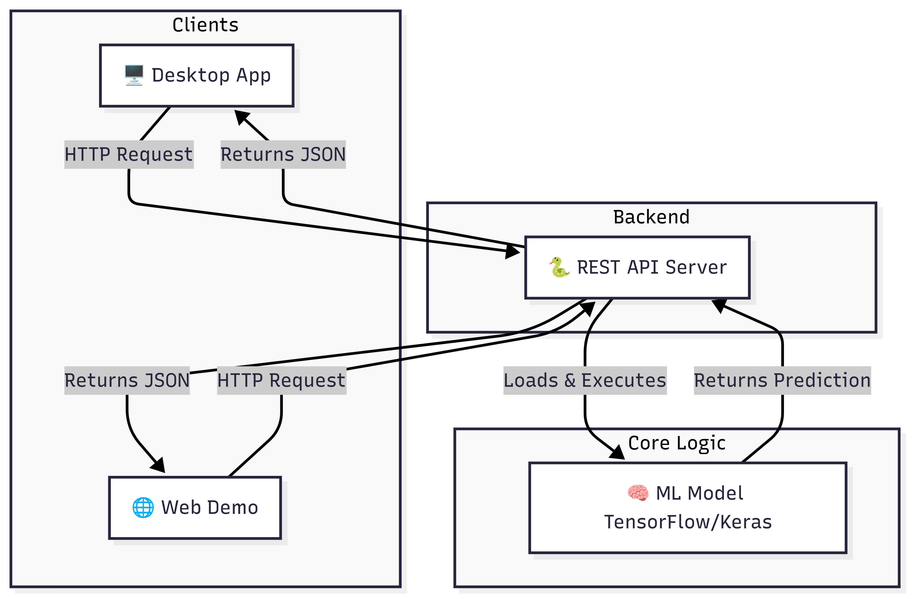
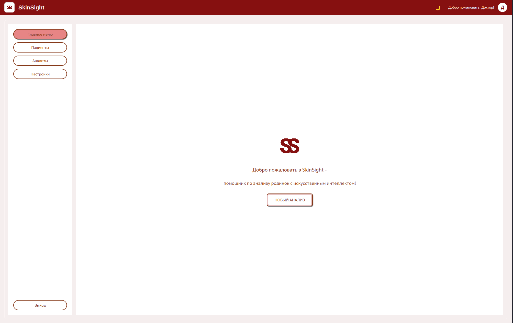
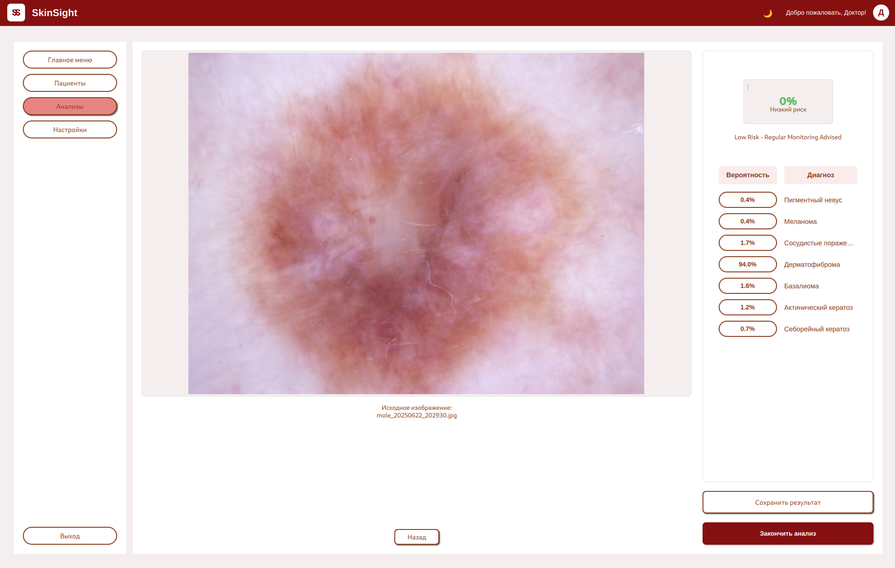

# SkinSight: AI-помощник для ранней диагностики рака кожи

[](https://www.python.org/downloads/)
[](https://www.qt.io/)
[](https://opensource.org/licenses/MIT)

SkinSight — это десктопное приложение для медицинских работников, использующее искусственный интеллект для ускорения и повышения точности диагностики меланомы и других новообразований кожи по фотографиям родинок.

## 🎯 О проекте

Проблема рака кожи стоит остро: рост заболеваемости и риск упустить драгоценное время для диагностики ведут к упущенным жизням. Ранняя диагностика на первой стадии может снизить летальность на **37.5%**.

SkinSight создан, чтобы стать надежным инструментом в руках врача, предоставляя **быстрый (< 15 секунд)** и **точный (> 90%)** анализ изображений родинок. Приложение не заменяет врача, а служит мощным помощником для поддержки принятия решений.

Основная аудитория — дерматологи, онкологи и терапевты в государственных и частных клиниках.

## ✨ Ключевые возможности

- **⚡ Быстрый AI-анализ**: Получение вероятностной оценки по нескольким классам новообразований (включая меланому) менее чем за 15 секунд.
- **📈 Высокая точность**: Модель, обученная на датасете ISIC из более чем 24,000 изображений, показывает точность ~95% (AUC для меланомы 0.94).
- **🗂️ Управление пациентами**: Создание и ведение карточек пациентов с медицинской историей и результатами анализов.
- **📊 История анализов**: Отслеживание динамики новообразований с возможностью сравнения результатов во времени.
- **🔄 Механизм дообучения**: Врачи могут верифицировать результаты AI, предоставляя обратную связь, которая используется для дальнейшего улучшения модели.
- **🔒 Безопасность и офлайн-доступ**: Как десктопное приложение, SkinSight обеспечивает высокий уровень безопасности данных пациента и может работать частично офлайн.
- **🖥️ Интуитивный интерфейс**: Современный и удобный интерфейс, созданный с помощью QML, делает работу с приложением простой и эффективной.

---

## 🏛️ Архитектура проекта

SkinSight — это не просто одно приложение, а клиент-серверная экосистема, состоящая из трех ключевых компонентов:


**Диаграмма архитектуры:**



1.  **REST API Server**:
    - **Роль**: Центральный "мозг" системы. Обрабатывает запросы на анализ изображений от клиентов.
    - **Технологии**: Python, FastAPI/Flask.
    - **Функционал**: Загружает ML-модель и предоставляет эндпоинт для получения прогнозов.

2.  **Десктопное приложение (этот репозиторий)**:
    - **Роль**: Полнофункциональный инструмент для врачей.
    - **Функционал**: Управление пациентами, история анализов, визуализация, механизм дообучения, безопасное хранение данных. Отправляет изображения на REST API для анализа.

3.  **Веб-сайт с демоверсией**:
    - **Роль**: Легковесный, публично доступный клиент для демонстрации возможностей AI.
    - **Ссылка**: **[skinsight-d6396.web.app](https://skinsight-d6396.web.app/)**
    - **Технологии**: React.
    - **Функционал**: Позволяет любому пользователю загрузить изображение и получить мгновенный анализ от того же REST API.

---

## 📂 Исходный код

Исходный код проекта распределен по разным репозиториям и веткам:

-   **Десктопное приложение (этот репозиторий)**:
    -   Содержит код для клиента на PySide6/QML.

-   **Веб-клиент и REST API**:
    -   **Репозиторий**: [github.com/kattywife/MoleAnalizerAI](https://github.com/kattywife/MoleAnalizerAI)
    -   **Ветка `Web`**: Содержит исходный код веб-сайта на React.
    -   **Ветка `SkinSight_API`**: Содержит исходный код REST API сервера на Python.

---

## 🛠️ Технологический стек

- **Backend**: Python, PySide6 (для интеграции с Qt)
- **Frontend**: QML (Qt 6.5+)
- **Машинное обучение**: TensorFlow, Keras, EfficientNetB0 (в качестве базовой архитектуры)
- **База данных**: MySQL (с возможностью адаптации под PostgreSQL)
- **Инфраструктура**: GitHub
- **Тестирование**: Pytest

## 📂 Структура проекта

```
SkinSight/
├── backend/                # Логика приложения на Python
│   ├── database_manager.py     # Управление всеми операциями с БД
│   ├── model_handler.py        # Загрузка модели и обработка изображений
│   └── backend_bridge.py       # Мост между Python и QML
├── frontend/               # Интерфейс на QML
│   ├── components/           # Переиспользуемые UI-компоненты (кнопки, таблицы и т.д.)
│   ├── screens/              # Основные экраны приложения (главный, анализ, пациенты)
│   └── assets/               # Изображения, иконки, шрифты
├── models/                 # Файлы обученной ML-модели
│   └── model.h5              # Модель Keras для классификации
├── uploads/                # Временно сохраняемые изображения родинок
├── tests/                  # Модульные и интеграционные тесты
├── config.json             # Файл конфигурации (данные для подключения к БД)
├── main.py                 # Главный исполняемый файл для запуска приложения
├── init_app.py             # Скрипт инициализации (например, создания БД)
├── requirements.txt        # Основные зависимости Python
└── requirements-dev.txt    # Зависимости для разработки и тестирования
```

## 🧠 ML Модель

Наша модель — это сверточная нейронная сеть (CNN) на базе архитектуры **EfficientNetB0**.

- **Датасет**: Модель обучена на публичном датасете **ISIC 2019**, содержащем **24,703** размеченных изображений.
- **Классы**: Модель выполняет мультиклассовую классификацию по следующим категориям:
  - Меланома (Melanoma)
  - Невус (Nevus)
  - Базальноклеточная карцинома (Basal cell carcinoma)
  - Актинический кератоз (Actinic keratosis)
  - Доброкачественный кератоз (Benign keratosis)
  - Дерматофиброма (Dermatofibroma)
  - Сосудистые поражения (Vascular lesions)
- **Метрики**: Ключевые показатели на тестовой выборке:
  - **Accuracy**: ~95%
  - **Precision**: ~90%
  - **Recall**: ~89%
  - **F1-Score**: ~94%
  - **AUC (ROC)**: 0.94 для меланомы, 0.97 для сосудистых поражений.

## 🗄️ Схема Базы Данных

Приложение использует реляционную базу данных MySQL для хранения информации. Основные таблицы:

- `patients`: Информация о пациентах (ФИО, дата рождения и т.д.).
- `doctors`: Информация о врачах, работающих с системой.
- `moles`: Данные о конкретных родинках, привязанные к пациенту.
- `images`: Пути к файлам изображений и метаданные.
- `analyses`: Результаты анализов, включая вероятность (`malignancy_probability`) и интерпретацию AI.
- `diagnoses`: Фактические диагнозы, подтвержденные врачом, связанные с анализом для дообучения модели.

При первом запуске приложение автоматически создаст все необходимые таблицы.

## 🚀 Установка и запуск

### Предварительные требования

- Python 3.8 или выше
- MySQL Server
- Qt 6.5+ (библиотеки для PySide6)

### Шаги по установке

1.  **Клонируйте репозиторий:**
    ```bash
    git clone https://github.com/kattywife/MoleAnalizerAI.git
    cd SkinSight
    ```

2.  **Создайте и активируйте виртуальное окружение:**
    ```bash
    python -m venv venv
    source venv/bin/activate  # Для Windows: venv\Scripts\activate
    ```

3.  **Установите зависимости:**
    ```bash
    pip install -r requirements.txt
    ```

4.  **Настройте базу данных:**
    - Убедитесь, что MySQL сервер запущен.
    - Отредактируйте файл `config.json`, указав ваши учетные данные для подключения к MySQL (host, user, password, port).
    - Базу данных с именем, указанным в `config.json`, создавать не нужно — приложение сделает это само.

5.  **Разместите модель:**
    - Убедитесь, что файл с обученной моделью `model.h5` находится в директории `models/`.

### Запуск приложения

```bash
python main.py
```

      
## 🖼️ Скриншоты приложения

Скриншоты из приложения SkinSight.

**Основной экран:**


**Просмотр результатов:**

    

## Разработка
*  QML-компоненты организованы в модули для повторного использования
*  В бэкенде используется PySide6 для интеграции с Qt
*  Работа с базой данных осуществляется через пул соединений
*  Анализ изображений выполняется асинхронно

## 🤝 Как внести свой вклад:

Мы приветствуем вклад в развитие SkinSight!

1. Создайте форк репозитория
2. Создайте ветку для вашей функциональности
3. Зафиксируйте изменения (commit)
4. Отправьте изменения в ветку (push)
5. Создайте Pull Request

## 👥 Команда

- **Кириченко Дана** - Team Lead / Frontend Developer
- **Хихлушка Екатерина** - Backend Developer
- **Осипов Антон** - AI/ML Specialist

---